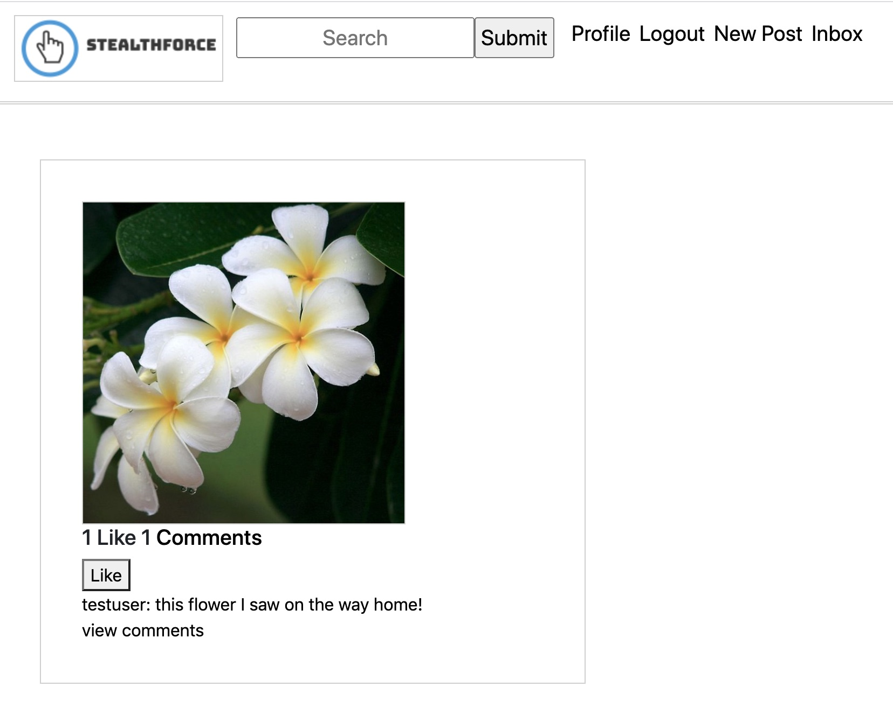
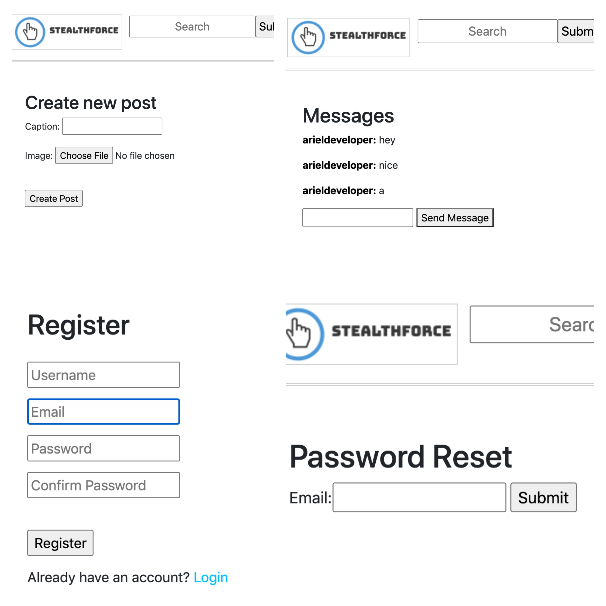
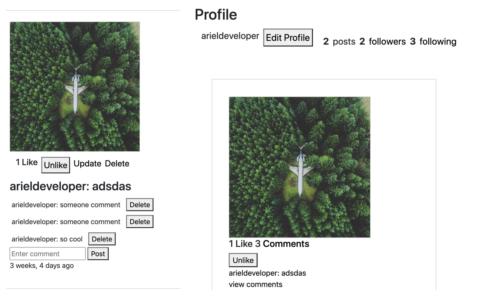

# stealthforce
Stealthforce is a social media web-application aimed for users to post about their hobbies, interests and projects in more detail than their regular social media pages. 

My goal for this project was to practice creating a full scale application in Django over the summer of 2020. There are still a couple little missing pieces that I am working on. 

## Running locally 
Install all the requirements:

```bash
pip install -r requirements.txt
```

Create the database:

```bash
python manage.py migrate
```

Run the development server:

```bash
python manage.py runserver
```
## Screenshots 




## Built with 
* Python and the Django Framework
